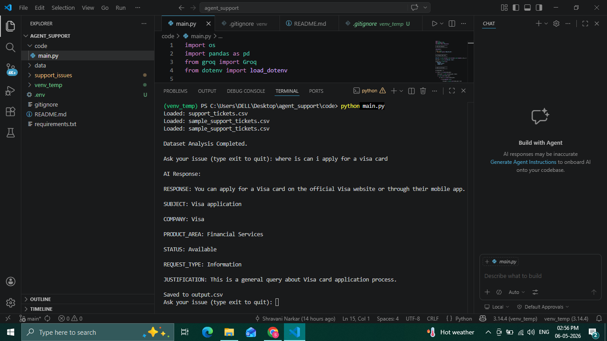
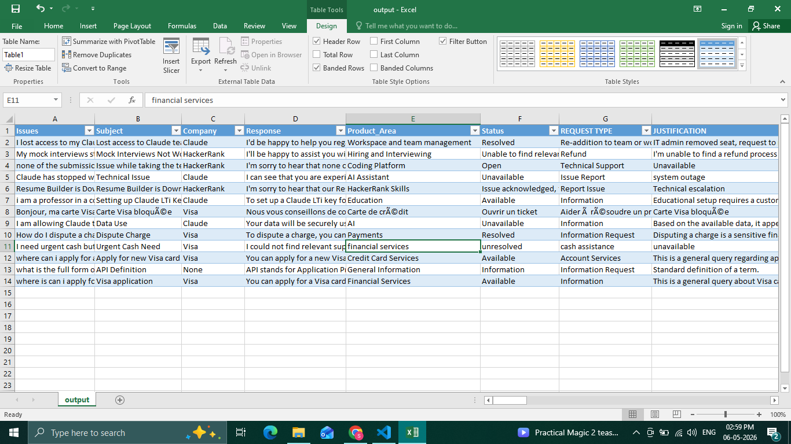
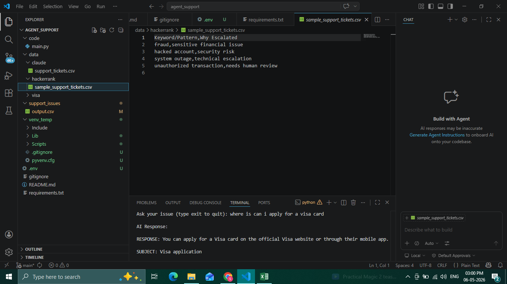

# 🤖 AI Support Issue Analysis Agent

This project is an AI-powered support issue analysis system designed to analyze customer support datasets, identify patterns, and provide intelligent insights using LLM-based reasoning.

---

## 🚀 Features

* 📊 Upload and analyze CSV datasets
* 🔍 Perform automated EDA (Exploratory Data Analysis)
* 📈 Detect issue patterns and trends
* 🤖 AI-powered query answering based on dataset insights

---

## 🛠️ Tech Stack

* Python
* Pandas
* NumPy
* Groq API
* LLM-based contextual analysis

---

## 📁 Project Structure

```
agent_support/
│── code/                # Main application logic
│── data/                # Sample datasets
│── support_issues/      # Generated outputs
│── requirements.txt
│── README.md
```

---

## ⚙️ Setup & Installation

### 1. Clone the repository

```
git clone https://github.com/your-username/customer_support_ai_agent.git
cd customer_support_ai_agent
```

---

### 2. Create a virtual environment (recommended)

```
python -m venv venv
venv\Scripts\activate      # On Windows
```

---

### 3. Install dependencies

```
pip install -r requirements.txt
```

---

### 4. Create `.env` file

Create a `.env` file in the root directory and add:

```
GROQ_API_KEY=your_api_key_here
```

---

### 5. Run the project

```
python code/main.py
```

---

## 📌 Notes

* Ensure your dataset is in CSV format
* Place datasets inside the `data/` folder
* Output files will be generated in `support_issues/`

---

## 💡 Future Improvements

* Add a web interface (Streamlit/Flask)
* Improve visualization dashboards
* Enhance multi-dataset comparison

---

## 📸 Project Demo

### 🔹 Generated Response / Output


### 🔹 Processed Data Snapshot


### 🔹 Keyword Extraction for Analysis

